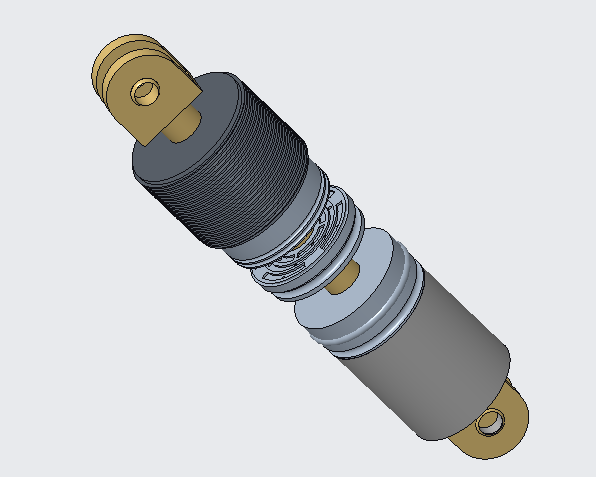
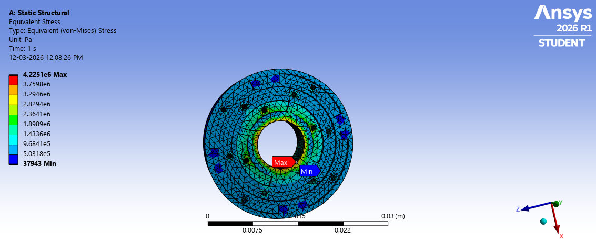
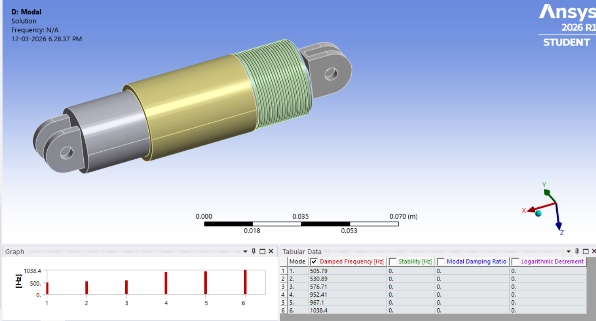
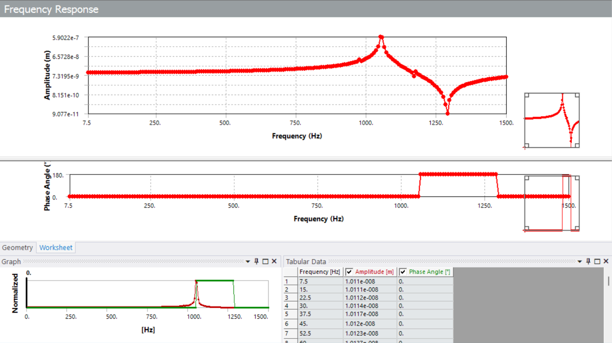
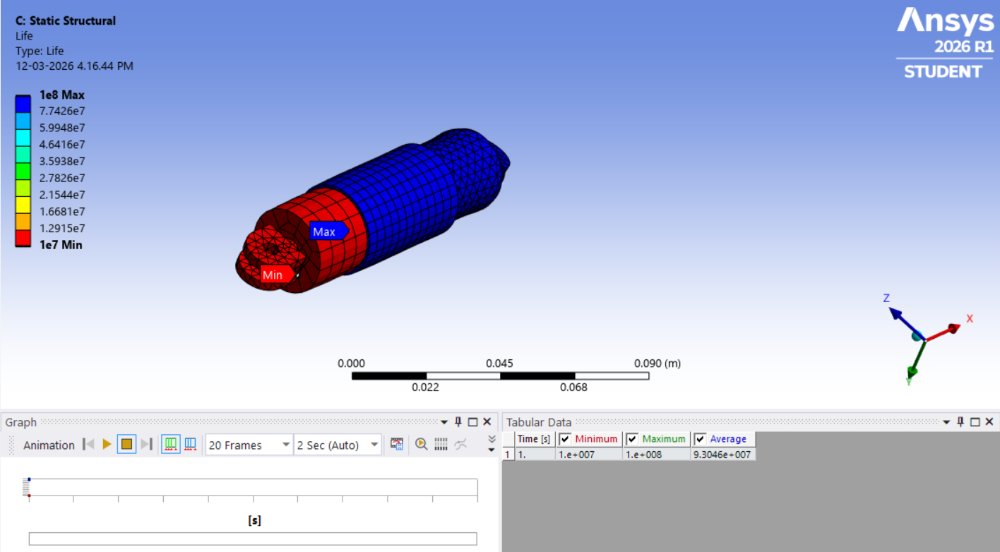
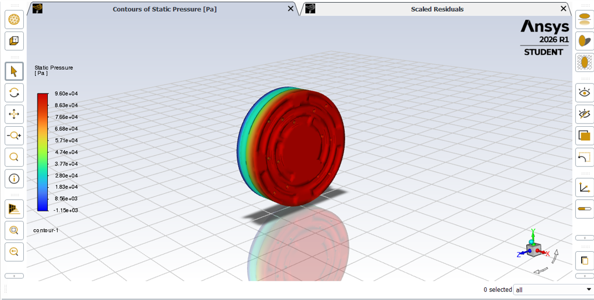
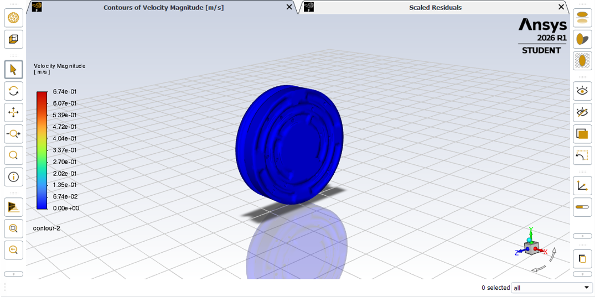

# Fluid Viscous Damper for UAV Payload Vibration Attenuation

## Overview 

## Overview

UAV payloads are highly sensitive to vibration, which can reduce image quality and sensor performance. This project focused on the design and analysis of a compact fluid viscous damper capable of attenuating vibrations in the 20–300 Hz operating range.

The project was completed by a two-member team as part of the TN IMPACT initiative at Coimbatore Institute of Technology.

## Design Specifications

| Parameter | Value |
|------------|-------|
| Overall Length | 97 mm |
| Overall Diameter | 28.5 mm |
| Fluid Chamber Length | 35 mm |
| Stroke Length | 24 mm |
| Piston Diameter | 24 mm |
| Working Fluid | Silicone Oil |
| Team Size | 2 |
| Software Used | CREO Parametric, ANSYS Workbench, MATLAB |

## My Role

The project was completed collaboratively, with responsibilities divided between both team members.

My primary contributions included:

- Designing the complete damper assembly in CREO Parametric
- Performing static, modal, harmonic, and fatigue analyses in ANSYS Workbench
- Interpreting simulation results and refining the design
- Preparing the technical documentation and presenting the engineering findings

## Design Approach

The project began with understanding the vibration characteristics of UAV payload systems and studying existing damping mechanisms.

After finalising the concept, the complete assembly was modelled in CREO. The CAD model was then imported into ANSYS Workbench, where different structural analyses were carried out to evaluate the behaviour of the design under operating conditions.

Based on the simulation results, the geometry was refined to improve structural stability and vibration attenuation while keeping the design compact.

## Engineering Analysis

### 1. Static Structural Analysis

The structural integrity of the proposed damper was evaluated using static structural analysis in ANSYS Workbench. The simulation was used to study stress distribution under the applied loading conditions and verify that the design remained structurally safe.

### 2. Modal Analysis

Modal analysis was performed to determine the natural frequencies and corresponding mode shapes of the proposed damper. This analysis helped evaluate the dynamic characteristics of the design and identify potential resonance conditions.

### 3. Harmonic Response Analysis

Harmonic response analysis was carried out to evaluate the behaviour of the damper under varying excitation frequencies. The results were used to study the vibration response and assess the effectiveness of the proposed design.

### 4. Fatigue Analysis

Fatigue analysis was performed to estimate the durability of the proposed damper under repeated loading conditions. The simulation provided an indication of the component's ability to withstand cyclic stresses during operation.

### 5. CFD Analysis

Computational Fluid Dynamics (CFD) analysis was conducted to study the flow characteristics of silicone oil through the segmented spiral orifice. Pressure and velocity distributions were analysed to better understand the damping behaviour of the proposed design.

#### Pressure Distribution

#### Velocity Distribution

## Conclusion

The proposed fluid viscous damper was successfully designed and evaluated using CAD, finite element analysis and CFD. The project provided valuable insights into vibration attenuation, structural behaviour and engineering design validation for UAV payload applications.

## Key Learning

This project gave me practical experience in taking a mechanical component from concept to simulation. More importantly, it helped me understand how CAD design decisions influence structural behaviour and how simulation can be used to validate engineering designs before manufacturing.

## Repository Contents

- CAD Models
- Simulation Results
- Engineering Calculations
- Project Report
- Supporting Images

## Author

**Shyam Siddarth M**

Mechanical Engineering Undergraduate

Coimbatore Institute of Technology
